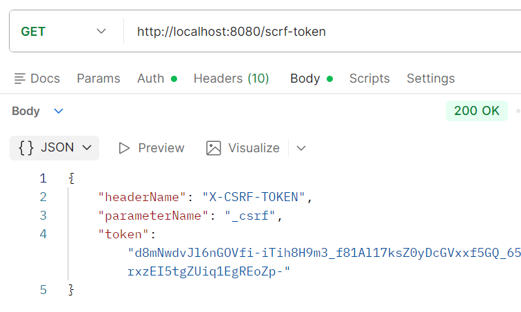
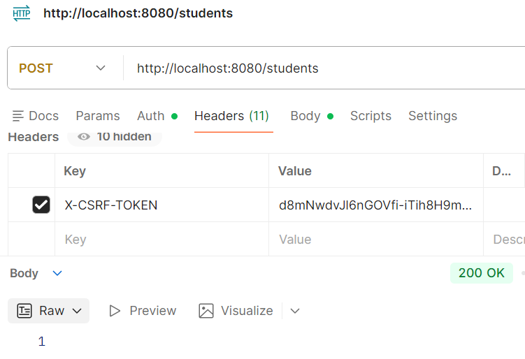

Usage in **Client Requests**:
- When performing actions like POST, PUT, or DELETE, the client must
include this token in the **request headers** (e.g., **X-CSRF-Token**) or as a
hidden form field.

Endpoint:
- The endpoint "/csrf-token" is mapped to this method, which allows clients
(e.g., frontend applications) to retrieve the CSRF token as needed for secure
communications.

